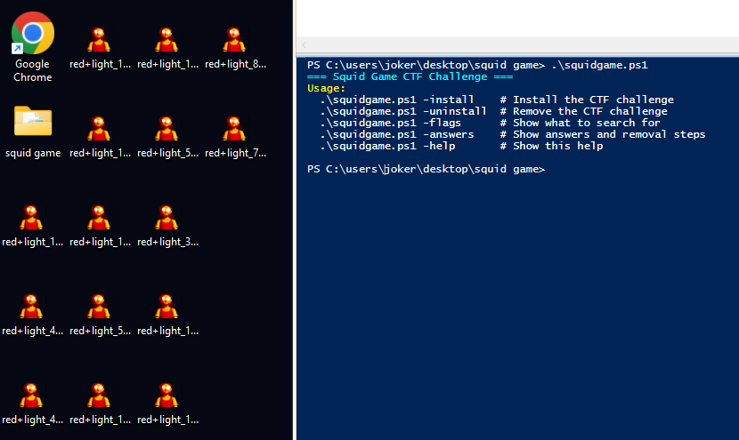

# Squidgame
## Squid Game CTF Challenge


# **DISCLAIMER**
> **This repository contains files that could harm your computer. Use with extreme caution.**  
> -  These scripts **will create numerous pop-ups** and modify system settings.  
> -  They **will not infect your network**, but they **will spam your desktop and system**.  
> -  **Do NOT run this if you don’t know what you’re doing.**  
> -  **Take a system snapshot (VM snapshot, restore point, or full backup) BEFORE running.**  
> -  An `.\squidgame.ps1 -uninstall` flag is provided, but **manual cleanup may still be required**.  
> -  **You are responsible for any damage caused.**

---
#  Objectives 
- Find the file with the full FLAG below, there are other two files which contain half of the flag, you will know when you see it.
- See if you can find all 3 FLAGS
- Most important, are you able to restore the system how it was without having to revert back to the snap shot?

#  Installing
To install simpli run `.\squidgame.ps1 -install` and your computer will become infected with the squidgame, happy cleaning!

#  Uninstaling
To get back your computer to normal state, run `.\squidgame.ps1 -uninstall`
It is still recommended to tak precautions and take snapshot before installing the squidgame

#  Flags
You can run the command `.\squidgame.ps1 -flags` to get a hint on the flags that you should look for.
Once you think you have clean up your computer to a good standard, compare your results with the answers.

#  Answers
To get the location of the files that were dropped, and the regKeys that were added run `.\squidgame.ps1 -answers`
Compare your results with the answers, did you find them all?

##  Usage

```powershell
.\squidgame.ps1 -install    # Install the CTF challenge
.\squidgame.ps1 -uninstall  # Remove the CTF challenge
.\squidgame.ps1 -flags      # Show what to search for
.\squidgame.ps1 -answers    # Show answers and removal steps
.\squidgame.ps1 -help       # Show this help
```

- Good luck have fun!    
